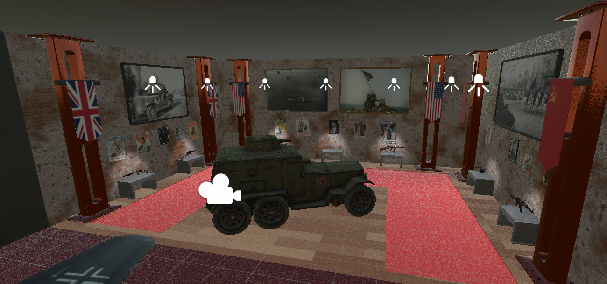

# VR Museum

projek virtual reality museum yang menampilkan senjata dan kendaraan era perang dunia kedua.

## Fitur

- Eksplorasi 3D
- Pengalaman Imersif

## Tech Stack

- Blender
- Unity 3D
- C#
- XR Plugin Management (Unity)

## Acknowledgements
- Sketchfab untuk model senjata dan kendaraan
